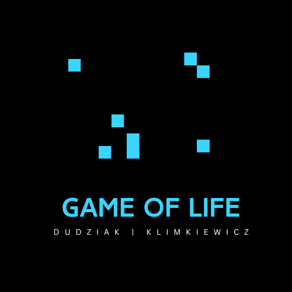

# Game of Life 
This project is based on rules invested in 1970 by mathematican John Convay. 
The basic statements of functionality of this game are below:
1. Any live cell with fewer than 2 neighbors dies
2. Any dead cell with more than 3 neighbors becomes a live cell
3. Any live cell with more than 3 live neigbors dies
4. Any live cell with 2 or 3 neighbors live on to the next generation

This game using raylib version 5.5 to display the simulation.
Tested on Windows 11.

  

